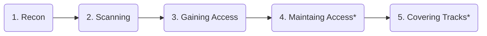

This is a cheatsheet, or quick reference for those commands and concepts that you quickly look to lookup. This page is broken up into:

- [Phases of Hacking](#phases-of-hacking)
- [Commands](#commands)
  - [Command: `nmap`](#command-nmap)
  - [Command: `gobuster`](#command-gobuster)
  - [Command: `nikto`](#command-nikto)
  - [Command: `hydra`](#command-hydra)
    - [OPTION 1. SSH with fixed username and password wordlist](#option-1-ssh-with-fixed-username-and-password-wordlist)
    - [OPTION 2: SSH with username wordlist and fixed password](#option-2-ssh-with-username-wordlist-and-fixed-password)
    - [OPTION 3: Webform with fixed username and password wordlist](#option-3-webform-with-fixed-username-and-password-wordlist)
    - [OPTION 4: Webform with username wordlist and fixed password](#option-4-webform-with-username-wordlist-and-fixed-password)
  - [Command: `searchsploit`](#command-searchsploit)
  - [Command `nc` - NetCat for listening/receiving](#command-nc---netcat-for-listeningreceiving)
- [Concepts](#concepts)
  - [Concept: Upgrading a fragile shell with Python `pty`](#concept-upgrading-a-fragile-shell-with-python-pty)
  - [Concept: Seeing what commands current user can use as `sudo`](#concept-seeing-what-commands-current-user-can-use-as-sudo)

## Phases of Hacking

Below are the Five Phase of Hacking:



*\* Only used in ethical Red Team engagements, or in black hat scenarios.*

## Commands

Below are command references.

### Command: `nmap`

The `nmap` command is used to scan for open ports on a target machine.

> **Context:** This tool is run during the recon phase when you have access to a target host, and want to see what services are running on it.
{: .prompt-tip }

```bash
nmap -sCV <IP>
```

### Command: `gobuster`

The `gobuster` command is used to enumerate and discover hidden files and directories on a web server.

> **Context:** This tool is run during the recon phase when you have a known web server, and want to see if common folder paths are on that web server. Using a wordlist like that medium one below attempts 220,560 possible folders on that target (e.g. `http://10.10.10.10/admin`, `http://10.10.10.10/login`, etc.)
{: .prompt-tip }

```bash
gobuster dir -w /usr/share/wordlists/dirbuster/directory-list-2.3-medium.txt \
    -u http://<IP>
```

### Command: `nikto`

The `nikto` command is a vulnerability scanner that is run against a web server. This looks for misconfigurations or other issues at the web server level.

> **Context:** This tool is run during the recon phase when you have a known web server, and want to see if there are common/known vulnerabilities in that hosting environment.
{: .prompt-tip }

```bash
nikto -h <IP>
```

### Command: `hydra`

#### OPTION 1. SSH with fixed username and password wordlist

```bash
hydra -l jdoe -P /usr/share/wordlists/rockyou.txt \
    ssh://<IP>
```

#### OPTION 2: SSH with username wordlist and fixed password

```bash
hydra -L ./usernames.txt -p admin \
    ssh://<IP>
```

#### OPTION 3: Webform with fixed username and password wordlist

```bash
hydra -l jdoe -P /usr/share/wordlists/rockyou.txt \
    <IP> http-post-form \
    "/login.php:username=^USER^&password=^PASS^&sub=Login:F=Invalid username or password."
```

#### OPTION 4: Webform with username wordlist and fixed password

```bash
hydra -L ./usernames.txt -p admin \
    <IP> http-post-form \
    "/login.php:username=^USER^&password=^PASS^&sub=Login:F=Invalid username or password."
```

### Command: `searchsploit`

```bash
searchsploit <keyword>
```

In the output, the location of those files are in: `/usr/share/exploitdb/exploits/`

### Command `nc` - NetCat for listening/receiving

```bash
nc -lvnp 9000
```

## Concepts

### Concept: Upgrading a fragile shell with Python `pty`

```bash
python3 -c 'import pty; pty.spawn("/bin/bash")'
```

### Concept: Seeing what commands current user can use as `sudo`

```bash
sudo -l
```
